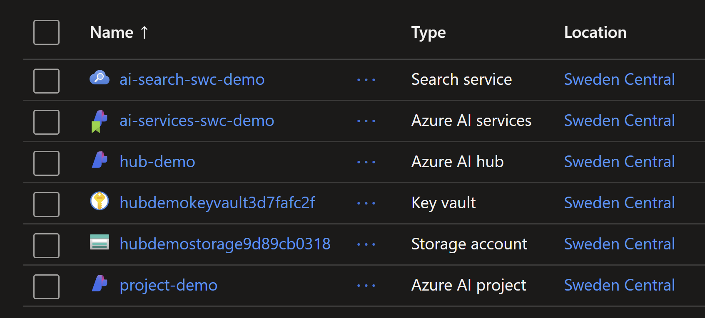

# Introduction to RAG with Azure OpenAI

## Introduction

This repository contains the code and instructions to create a RAG (Retrieval Augmented Generation) model using Azure OpenAI.

## Create Azure AI Search resource

```sh
$rgName = "rg-openai-course2"
$aiSearchName = "ai-search-swc-demo2"
$aiServiceName = "ai-services-swc-demo2"
$location = "swedencentral"
```

### 1. Create a resource group

```sh
az group create -n $rgName -l $location
```

### 2. Create a search service

```sh
az search service create -n $aiSearchName -g $rgName --sku free
```

### 3. Get the admin key

```sh
az search admin-key show --service-name $aiSearchName -g $rgName
# {
#   "primaryKey": "4wIdp9wU2xwTM5ltGro4wNF1VPXwPcrrHMuoy47CYeAzSxxxxxxxx",
#   "secondaryKey": "oa1LM4JA47W4lby8wa8cfOvBKif8I4CidFMTHG71yPAzxxxxxxx"
# }
```

## Create an Azure AI Services resource

```sh
az cognitiveservices account create -n $aiServiceName -g $rgName --kind AIServices --sku S0 --location $location
```

### Get the endpoint URL, Keys and resource ID

```sh
az cognitiveservices account show -n $aiServiceName -g $rgName --query properties.endpoint
# "https://swedencentral.api.cognitive.microsoft.com/"

az cognitiveservices account keys list -n $aiServiceName -g $rgName
# {
#   "key1": "78f5592e1f70494dabd1a4040a61a96a",
#   "key2": "4f23266a2eb0475c8a0112044e03c4d1"
# }

az cognitiveservices account show -n $aiServiceName -g $rgName --query id
# "/subscriptions/38977b70-47bf-4da5-a492-xxxxxxxxx/resourceGroups/rg-openai-course2/providers/Microsoft.CognitiveServices/accounts/ai-services-swc-demo"
```

## Creating deployment for ChatGPT 4o model

```sh
az cognitiveservices account deployment create -n $aiServiceName -g $rgName `
    --deployment-name gpt-4o `
    --model-name gpt-4o `
    --model-version "2024-05-13" `
    --model-format OpenAI `
    --sku-capacity "148" `
    --sku-name "Standard"
```

## Creating an embedding model

Replace ` with \ if you are using Linux or MacOS.

```sh
az cognitiveservices account deployment create -n $aiServiceName -g $rgName `
    --deployment-name text-embedding-3-large `
    --model-name text-embedding-3-large `
    --model-version "1" `
    --model-format OpenAI `
    --sku-capacity "227" `
    --sku-name "Standard"
```
## Create a Hub and Project in Azure AI Studio

### Create a Hub

```sh
az extension add -n ml
az extension update -n ml

az ml workspace create --kind hub -g $rgName -n hub-demo
```

### Create a Project

Creating a new project using Azure CLI like the following is not yet supported. You can create a project using the Azure AI studio.

```sh
$hubId=$(az ml workspace show -g $rgName -n hub-demo --query id -o tsv)

az ml workspace create --kind project --hub-id $hubId -g $rgName -n project-demo
```

### Create the connection.yml file

Create a file named `connection.yml` with the following content to link `AI Services` to the `Hub`. Make sure to replace the values with your own.

```yml
name: ai-service-connection
type: azure_ai_services
endpoint: https://swedencentral.api.cognitive.microsoft.com/
api_key: 246cbcb9e3194fd5a09935a8418fe99a
ai_services_resource_id: /subscriptions/38977b70-47bf-4da5-a492-88712fce8725/resourceGroups/rg-openai-course2/providers/Microsoft.CognitiveServices/accounts/ai-services-swc-demo2
```

Deploy the connection using the following command.

```sh
az ml connection create --file connection.yml -g $rgName --workspace-name hub-demo
```

### Confirm the resources

Confirm you have the folloeing resources in your Azure portal.

