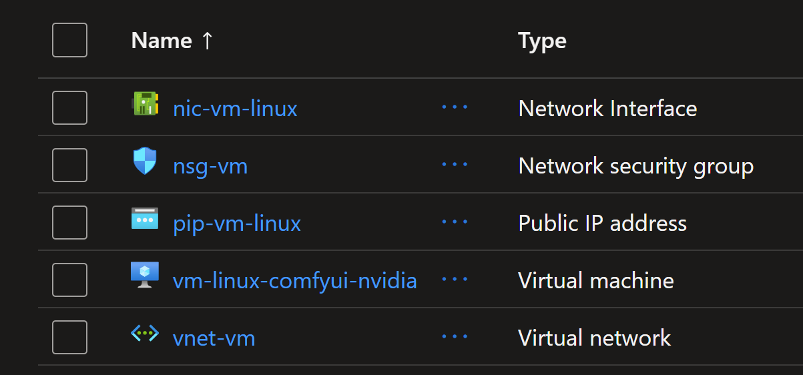

# Running Text to Image and Text to Video with ComfyUI and Nvidia H100 GPU

This guide provides instructions on how to set up and run `Text to Image` and `Text to Video` generation using `ComfyUI` with an `Nvidia H100 GPU` on Azure.


## Steps to create the infrastructure

### Option 1. Using Terraform (Recommended)

In this guide, the provided Terraform template will create the following:

0. Create the infrastructure for Ubuntu VM with `Nvidia H100 GPU`
1. Install CUDA drivers on the VM
2. Install `ComfyUI` on the VM
3. Download the models for Text to Image (`Z-Image-Turbo`) and Text to Video generation (`Wan 2.2` and `LTX-2`)

```sh
# Initialize Terraform
terraform init

# Review the Terraform plan
terraform plan tfplan

# Apply the Terraform configuration to create resources
terraform apply tfplan
```

This should take about 15 minutes to create all the resources with the configuration defined in the Terraform files.

The following resources will be created:



If you choose to use Terraform, after the deployment is complete, you can access the ComfyUI portal using the output link shown in the Terraform output. It should look like this `http://<VM_IP_ADDRESS>:8188`. And that should be the end of the setup. You can then proceed to use ComfyUI for Text to Image and Text to Video generation as described in the later sections.

### Option 2. Manual Setup

### 0. Create a Virtual Machine with Nvidia H100 GPU

Create an Azure virtual machine with `Nvidia H100` GPUs like sku: `Standard NC40ads H100 v5`. Choose a Linux distribution of your choice like `Ubuntu Pro 24.04 LTS`. Disable Secure Boot as it is not supported for GPU drivers installation with the Custom Extension.

### 1. Install Nvidia GPU and CUDA Drivers

SSH into the Ubuntu VM and install the CUDA drivers by following the official Microsoft documentation: [Install CUDA drivers on N-series VMs](https://learn.microsoft.com/en-us/azure/virtual-machines/linux/n-series-driver-setup#install-cuda-drivers-on-n-series-vms).

```sh
# 1. Install ubuntu-drivers utility:
sudo apt-get update
sudo apt-get install ubuntu-drivers-common -y

# 2. Install the latest NVIDIA drivers:
sudo ubuntu-drivers install

# 3. Download and install the CUDA toolkit from NVIDIA:
wget https://developer.download.nvidia.com/compute/cuda/repos/ubuntu2404/x86_64/cuda-keyring_1.1-1_all.deb
sudo dpkg -i cuda-keyring_1.1-1_all.deb
sudo apt-get update
sudo apt-get -y install cuda-toolkit-13-1

# 4. Reboot the system to apply changes
sudo reboot
```

The machine will now reboot. After rebooting, you can verify the installation of the NVIDIA drivers and CUDA toolkit.

```sh
# 5. Verify that the GPU is correctly recognized (after reboot):
nvidia-smi

# 6. We recommend that you periodically update NVIDIA drivers after deployment.
sudo apt-get update
sudo apt-get full-upgrade -y
```

### 2. Install ComfyUI on Ubuntu

Follow the instructions from the ComfyUI Wiki to install ComfyUI on your Ubuntu VM using Comfy CLI: [Install ComfyUI using Comfy CLI](https://comfyui-wiki.com/en/install/install-comfyui/install-comfyui-on-linux).

```sh
# Step 1: System Environment Preparation
# ComfyUI requires Python 3.12 or higher (Python 3.13 is recommended). Check your Python version:
python3 --version

# If Python is not installed or the version is too low, install it following these steps:
sudo apt-get update
sudo apt-get install python3 python3-pip python3-venv -y

# Create Virtual Environment
# Using a virtual environment can avoid package conflict issues
python3 -m venv comfy-env
 
# Activate the virtual environment
source comfy-env/bin/activate
# Note: You need to activate the virtual environment each time before using ComfyUI. To exit the virtual environment, use the deactivate command.

# Step 2: Install Comfy CLI
# Install comfy-cli in the activated virtual environment:
pip install comfy-cli

# Step 3: Install ComfyUI using Comfy CLI with NVIDIA GPU Support
# use 'yes' to accept all prompts
yes | comfy install --nvidia

# Step 4: Install GPU Support for PyTorch
pip install torch torchvision torchaudio --extra-index-url https://download.pytorch.org/whl/cu130

# Note: Please choose the corresponding PyTorch version based on your CUDA version. Visit the PyTorch website for the latest installation commands.

# Step 5. Launch ComfyUI
# By default, ComfyUI will run on http://localhost:8188.
# and don't forget the double -- 
comfy launch --background -- --listen 0.0.0.0 --port 8188
```

>Note that you can run ComfyUI with different modes based on your hardware capabilities:
`--cpu`: Use CPU mode, if you don't have a compatible GPU
`--lowvram`: Low VRAM mode
`--novram`: Ultra-low VRAM mode

## 3. Using ComfyUI for Text to Image

Once ComfyUI is running, you can access the web interface via your browser at `http://<VM_IP_ADDRESS>:8188` (replace `<VM_IP_ADDRESS>` with the actual IP address of your VM).

>Note that you should ensure that the VM's network security group (NSG) allows inbound traffic on port `8188`.

You can create Text to Image generation workflows using the templates available in ComfyUI.

Go to Workflows and select a Text to Image template to get started. Choose `Z-Image-Turbo Text to Image` as an example.


After that, ComfyUI will detect that there are some missing models to download.


You will need to download each model into its corresponding folder. For example, the Stable Diffusion model should be placed in the `models/Stable-diffusion` folder.
The models download links and their corresponding folders are shown in the ComfyUI interface.

Let's download the required models for `Z-Image-Turbo`.

```sh
cd comfy/ComfyUI/

wget -P models/text_encoders/ https://huggingface.co/Comfy-Org/z_image_turbo/resolve/main/split_files/text_encoders/qwen_3_4b.safetensors

wget -P models/vae/ https://huggingface.co/Comfy-Org/z_image_turbo/resolve/main/split_files/vae/ae.safetensors

wget -P models/diffusion_models/ https://huggingface.co/Comfy-Org/z_image_turbo/resolve/main/split_files/diffusion_models/z_image_turbo_bf16.safetensors

wget -P models/loras/ https://huggingface.co/tarn59/pixel_art_style_lora_z_image_turbo/resolve/main/pixel_art_style_z_image_turbo.safetensors
```


>Note that here you can either use `comfy model download` command or `wget` to download the models into their corresponding folders.

Once the models are downloaded, you can run the Text to Video workflow in ComfyUI. You can also change the parameters as needed like the prompt.


When ready, click the Run blue button at the top right to start generating the image. It will take some time depending on the size of the image and the complexity of the prompt. Then you should see the generated image in the output node.

## 5. Using ComfyUI for Text to Video

To use ComfyUI for Text to Video generation, you can select a Text to Video template from the Workflows section. Choose `Wan 2.2 Text to Video` as an example.

Then you will need to install the required models for `Wan 2.2 Text to Video`.

```sh
wget -P models/text_encoders/ https://huggingface.co/Comfy-Org/Wan_2.1_ComfyUI_repackaged/resolve/main/split_files/text_encoders/umt5_xxl_fp8_e4m3fn_scaled.safetensors

wget -P models/vae/ https://huggingface.co/Comfy-Org/Wan_2.2_ComfyUI_Repackaged/resolve/main/split_files/vae/wan_2.1_vae.safetensors

wget -P models/diffusion_models/ https://huggingface.co/Comfy-Org/Wan_2.2_ComfyUI_Repackaged/resolve/main/split_files/diffusion_models/wan2.2_t2v_low_noise_14B_fp8_scaled.safetensors  

wget -P models/diffusion_models/ https://huggingface.co/Comfy-Org/Wan_2.2_ComfyUI_Repackaged/resolve/main/split_files/diffusion_models/wan2.2_t2v_high_noise_14B_fp8_scaled.safetensors

wget -P models/loras/ https://huggingface.co/Comfy-Org/Wan_2.2_ComfyUI_Repackaged/resolve/main/split_files/loras/wan2.2_t2v_lightx2v_4steps_lora_v1.1_high_noise.safetensors

wget -P models/loras/ https://huggingface.co/Comfy-Org/Wan_2.2_ComfyUI_Repackaged/resolve/main/split_files/loras/wan2.2_t2v_lightx2v_4steps_lora_v1.1_low_noise.safetensors
```

Models for `LTX-2` Text to Video can be downloaded similarly.

```sh
wget -P models/checkpoints/ https://huggingface.co/Lightricks/LTX-2/resolve/main/ltx-2-19b-dev-fp8.safetensors

wget -P models/text_encoders/ https://huggingface.co/Comfy-Org/ltx-2/resolve/main/split_files/text_encoders/gemma_3_12B_it_fp4_mixed.safetensors

wget -P models/latent_upscale_models/ https://huggingface.co/Lightricks/LTX-2/resolve/main/ltx-2-spatial-upscaler-x2-1.0.safetensors

wget -P models/loras/ https://huggingface.co/Lightricks/LTX-2/resolve/main/ltx-2-19b-distilled-lora-384.safetensors

wget -P models/loras/ https://huggingface.co/Lightricks/LTX-2-19b-LoRA-Camera-Control-Dolly-Left/resolve/main/ltx-2-19b-lora-camera-control-dolly-left.safetensors
```

Models for `Qwen Image 2512` Text to Image can be downloaded similarly.

```sh
wget -P models/text_encoders/ https://huggingface.co/Comfy-Org/Qwen-Image_ComfyUI/resolve/main/split_files/text_encoders/qwen_2.5_vl_7b_fp8_scaled.safetensors

wget -P models/vae/ https://huggingface.co/Comfy-Org/Qwen-Image_ComfyUI/resolve/main/split_files/vae/qwen_image_vae.safetensors

wget -P models/diffusion_models/ https://huggingface.co/Comfy-Org/Qwen-Image_ComfyUI/resolve/main/split_files/diffusion_models/qwen_image_2512_fp8_e4m3fn.safetensors

wget -P models/loras/ https://huggingface.co/lightx2v/Qwen-Image-Lightning/resolve/main/Qwen-Image-Lightning-4steps-V1.0.safetensors
```

Models for Flux2 Klein Text to Image 9B can be downloaded similarly.

```sh
wget -P models/text_encoders/ https://huggingface.co/Comfy-Org/flux2-klein-9B/resolve/main/split_files/text_encoders/qwen_3_8b_fp8mixed.safetensors

wget -P models/vae/ https://huggingface.co/Comfy-Org/flux2-dev/resolve/main/split_files/vae/flux2-vae.safetensors

wget -P models/diffusion_models/ https://huggingface.co/black-forest-labs/FLUX.2-klein-base-9b-fp8/resolve/main/flux-2-klein-base-9b-fp8.safetensors

wget -P models/diffusion_models/ https://huggingface.co/black-forest-labs/FLUX.2-klein-9b-fp8/resolve/main/flux-2-klein-9b-fp8.safetensors
```

## Important notes

Secure Boot is not supported using Windows or Linux extensions. For more information on manually installing GPU drivers with Secure Boot enabled, see Azure N-series GPU driver setup for Linux. Src: https://learn.microsoft.com/en-us/azure/virtual-machines/extensions/hpccompute-gpu-linux

## Sources

- [Install CUDA drivers on N-series VMs](https://learn.microsoft.com/en-us/azure/virtual-machines/linux/n-series-driver-setup#install-cuda-drivers-on-n-series-vms)

- [Install ComfyUI using Comfy CLI](https://comfyui-wiki.com/en/install/install-comfyui/install-comfyui-on-linux)