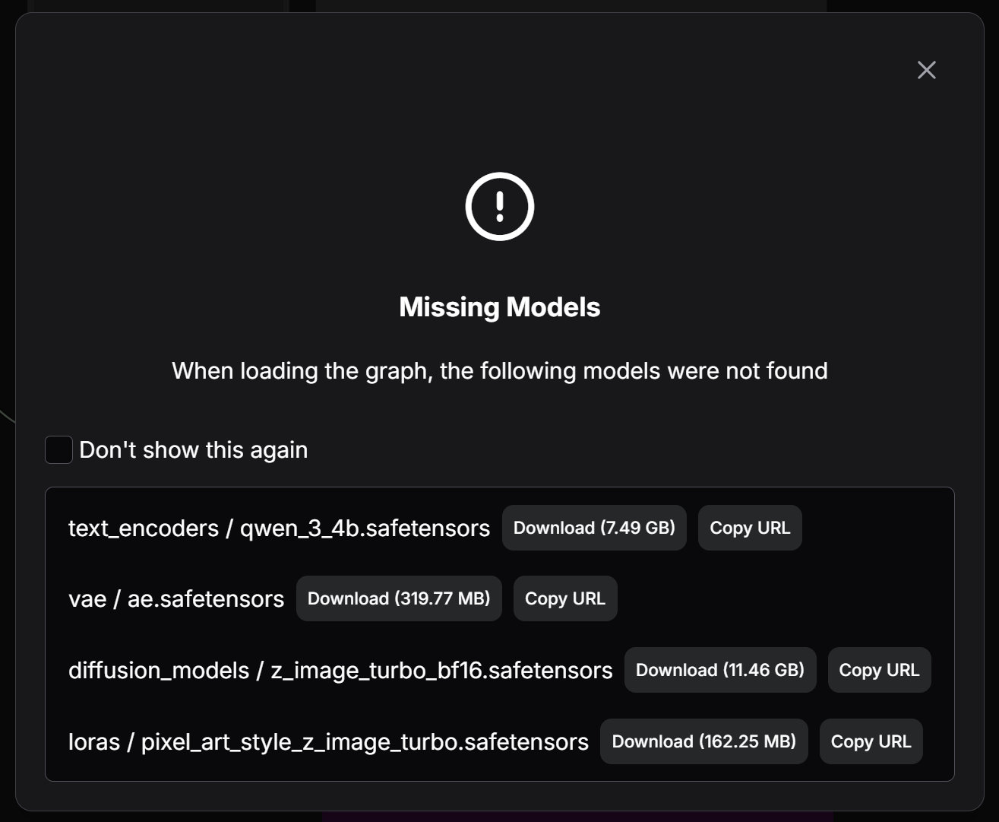
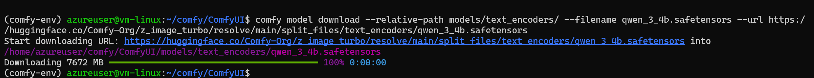
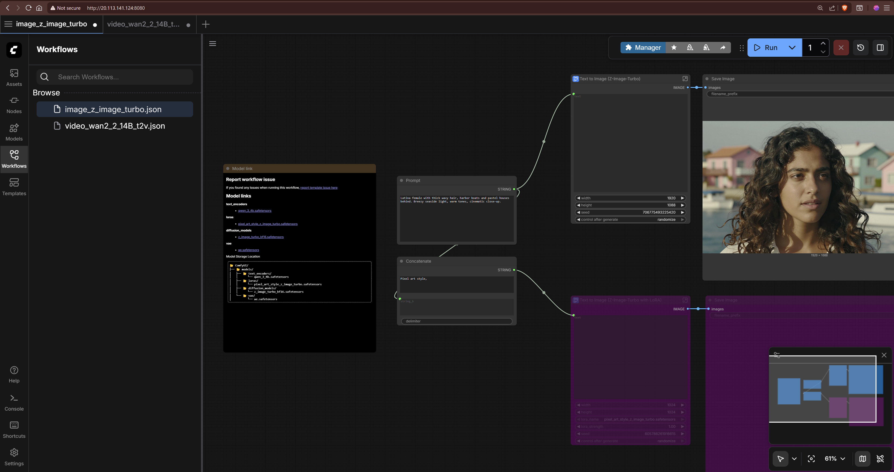

# Running Text to Image and Text to Video with ComfyUI and Nvidia H100 GPU

This guide provides instructions on how to set up and run Text to Image and Text to Video generation using ComfyUI with an Nvidia H100 GPU.

## Steps to create the infrastructure

### 1. Create a Virtual Machine with Nvidia H100 GPU

Create an Azure virtual machine with `Nvidia H100` GPUs like sku: `Standard NC40ads H100 v5`. Choose a Linux distribution of your choice like `Ubuntu Pro 24.04`.

### 2. Install CUDA Drivers

SSH into the Ubuntu VM and install the CUDA drivers by following the official Microsoft documentation: [Install CUDA drivers on N-series VMs](https://learn.microsoft.com/en-us/azure/virtual-machines/linux/n-series-driver-setup#install-cuda-drivers-on-n-series-vms).

```sh
# 1. Install ubuntu-drivers utility:
sudo apt update && sudo apt install -y ubuntu-drivers-common

# 2. Install the latest NVIDIA drivers:
sudo ubuntu-drivers install

# 3. Download and install the CUDA toolkit from NVIDIA:
wget https://developer.download.nvidia.com/compute/cuda/repos/ubuntu2404/x86_64/cuda-keyring_1.1-1_all.deb
sudo apt install -y ./cuda-keyring_1.1-1_all.deb
sudo apt update
sudo apt -y install cuda-toolkit-13-1

# 4. Reboot the VM after installation completes:
sudo reboot
```

The machine will now reboot. After rebooting, you can verify the installation of the NVIDIA drivers and CUDA toolkit.

```sh
# 5. Verify that the GPU is correctly recognized (after reboot):
nvidia-smi

# 6. We recommend that you periodically update NVIDIA drivers after deployment.
sudo apt update
sudo apt full-upgrade
```

### 3. Install ComfyUI on Ubuntu

Follow the instructions from the ComfyUI Wiki to install ComfyUI on your Ubuntu VM using Comfy CLI: [Install ComfyUI using Comfy CLI](https://comfyui-wiki.com/en/install/install-comfyui/install-comfyui-on-linux).

```sh
# Step 1: System Environment Preparation
# ComfyUI requires Python 3.12 or higher (Python 3.13 is recommended). Check your Python version:
python3 --version

# If Python is not installed or the version is too low, install it following these steps:
sudo apt update
sudo apt install python3 python3-pip python3-venv -y

# Create Virtual Environment
# Using a virtual environment can avoid package conflict issues:
# Create a virtual environment named comfy-env
python3 -m venv comfy-env
 
# Activate the virtual environment
source comfy-env/bin/activate
# Note: You need to activate the virtual environment each time before using ComfyUI. To exit the virtual environment, use the deactivate command.

# Step 2: Install Comfy CLI
# Install comfy-cli in the activated virtual environment:

pip install comfy-cli

# Configure Command Line Auto-completion (Optional)
# To get a better user experience, you can enable command line auto-completion:

comfy --install-completion

# Step 3: Install ComfyUI
# Installing ComfyUI with comfy-cli is very simple, requiring just one command:
# use 'yes' to accept all prompts
yes | comfy install --nvidia

# Step 4: Install GPU Support
# NVIDIA GPU (CUDA)
# If you’re using an NVIDIA GPU, you need to install CUDA support:

# Install PyTorch with CUDA support
pip install torch torchvision torchaudio --extra-index-url https://download.pytorch.org/whl/cu130

# Note: Please choose the corresponding PyTorch version based on your CUDA version. Visit the PyTorch website for the latest installation commands.

# Step 5: Launch ComfyUI
# After installation is complete, launch ComfyUI:
# comfy launch

# By default, ComfyUI will run on http://localhost:8188.

# Common Launch Options
# Specify listen address and port
# and don't forget the double -- 
comfy launch --background -- --listen 0.0.0.0 --port 8080
 
# Use CPU mode
# comfy launch -- --cpu
 
# Low VRAM mode
# comfy launch -- --lowvram
 
# Ultra-low VRAM mode
# comfy launch -- --novram
```

## 4. Using ComfyUI for Text to Image

Once ComfyUI is running, you can access the web interface via your browser at `http://<VM_IP_ADDRESS>:8080` (replace `<VM_IP_ADDRESS>` with the actual IP address of your VM).

You can create Text to Image generation workflows using the templates available in ComfyUI.

Go to Workflows and select a Text to Image template to get started. Choose `Z-Image-Turbo Text to Image` as an example.


After that, ComfyUI will detect that there are some missing models to download.



You will need to download each model into its corresponding folder. For example, the Stable Diffusion model should be placed in the `models/Stable-diffusion` folder.
The models download links and their corresponding folders are shown in the ComfyUI interface.

Let's download the required models for `Z-Image-Turbo`.

```sh
cd comfy/ComfyUI/

comfy model download --relative-path models/text_encoders/ --filename qwen_3_4b.safetensors --url https://huggingface.co/Comfy-Org/z_image_turbo/resolve/main/split_files/text_encoders/qwen_3_4b.safetensors

comfy model download --relative-path models/vae --filename ae.safetensors --url https://huggingface.co/Comfy-Org/z_image_turbo/resolve/main/split_files/vae/ae.safetensors

comfy model download --relative-path models/diffusion_models/ --filename z_image_turbo_bf16.safetensors --url https://huggingface.co/Comfy-Org/z_image_turbo/resolve/main/split_files/diffusion_models/z_image_turbo_bf16.safetensors

comfy model download --relative-path models/loras/ --filename pixel_art_style_z_image_turbo.safetensors --url https://huggingface.co/tarn59/pixel_art_style_lora_z_image_turbo/resolve/main/pixel_art_style_z_image_turbo.safetensors
```



Once the models are downloaded, you can run the Text to Video workflow in ComfyUI. You can also change the parameters as needed like the prompt.



When ready, click the Run blue button at the top right to start generating the image. It will take some time depending on the size of the image and the complexity of the prompt. Then you should see the generated image in the output node.

## 5. Using ComfyUI for Text to Video

To use ComfyUI for Text to Video generation, you can select a Text to Video template from the Workflows section. Choose `Wan 2.2 Text to Video` as an example.

Then you will need to install the required models for `Wan 2.2 Text to Video`.

```sh
comfy model download --relative-path models/text_encoders/ --filename umt5_xxl_fp8_e4m3fn_scaled.safetensors --url https://huggingface.co/Comfy-Org/Wan_2.1_ComfyUI_repackaged/resolve/main/split_files/text_encoders/umt5_xxl_fp8_e4m3fn_scaled.safetensors

comfy model download --relative-path models/vae --filename wan_2.1_vae.safetensors --url https://huggingface.co/Comfy-Org/Wan_2.2_ComfyUI_Repackaged/resolve/main/split_files/vae/wan_2.1_vae.safetensors

comfy model download --relative-path models/diffusion_models/ --filename wan2.2_t2v_low_noise_14B_fp8_scaled.safetensors --url https://huggingface.co/Comfy-Org/Wan_2.2_ComfyUI_Repackaged/resolve/main/split_files/diffusion_models/wan2.2_t2v_low_noise_14B_fp8_scaled.safetensors

comfy model download --relative-path models/diffusion_models/ --filename wan2.2_t2v_high_noise_14B_fp8_scaled.safetensors --url https://huggingface.co/Comfy-Org/Wan_2.2_ComfyUI_Repackaged/resolve/main/split_files/diffusion_models/wan2.2_t2v_high_noise_14B_fp8_scaled.safetensors

comfy model download --relative-path models/loras/ --filename wan2.2_t2v_lightx2v_4steps_lora_v1.1_high_noise.safetensors --url https://huggingface.co/Comfy-Org/Wan_2.2_ComfyUI_Repackaged/resolve/main/split_files/loras/wan2.2_t2v_lightx2v_4steps_lora_v1.1_high_noise.safetensors

comfy model download --relative-path models/loras/ --url https://huggingface.co/Comfy-Org/Wan_2.2_ComfyUI_Repackaged/resolve/main/split_files/loras/wan2.2_t2v_lightx2v_4steps_lora_v1.1_low_noise.safetensors
```

Models for LTX-2 Text to Video can be downloaded similarly.

```sh
comfy model download --relative-path models/checkpoints/ --filename ltx-2-19b-dev-fp8.safetensors --url https://huggingface.co/Lightricks/LTX-2/resolve/main/ltx-2-19b-dev-fp8.safetensors

comfy model download --relative-path models/text_encoders/ --filename gemma_3_12B_it_fp4_mixed.safetensors --url https://huggingface.co/Comfy-Org/ltx-2/resolve/main/split_files/text_encoders/gemma_3_12B_it_fp4_mixed.safetensors

comfy model download --relative-path models/latent_upscale_models/ --filename ltx-2-spatial-upscaler-x2-1.0.safetensors --url https://huggingface.co/Lightricks/LTX-2/resolve/main/ltx-2-spatial-upscaler-x2-1.0.safetensors

comfy model download --relative-path models/loras/ --filename ltx-2-19b-distilled-lora-384.safetensors --url https://huggingface.co/Lightricks/LTX-2/resolve/main/ltx-2-19b-distilled-lora-384.safetensors

comfy model download --relative-path models/loras/ --filename ltx-2-19b-lora-camera-control-dolly-left.safetensors --url https://huggingface.co/Lightricks/LTX-2-19b-LoRA-Camera-Control-Dolly-Left/resolve/main/ltx-2-19b-lora-camera-control-dolly-left.safetensors
```

## Sources

- [Install CUDA drivers on N-series VMs](https://learn.microsoft.com/en-us/azure/virtual-machines/linux/n-series-driver-setup#install-cuda-drivers-on-n-series-vms)

- [Install ComfyUI using Comfy CLI](https://comfyui-wiki.com/en/install/install-comfyui/install-comfyui-on-linux)