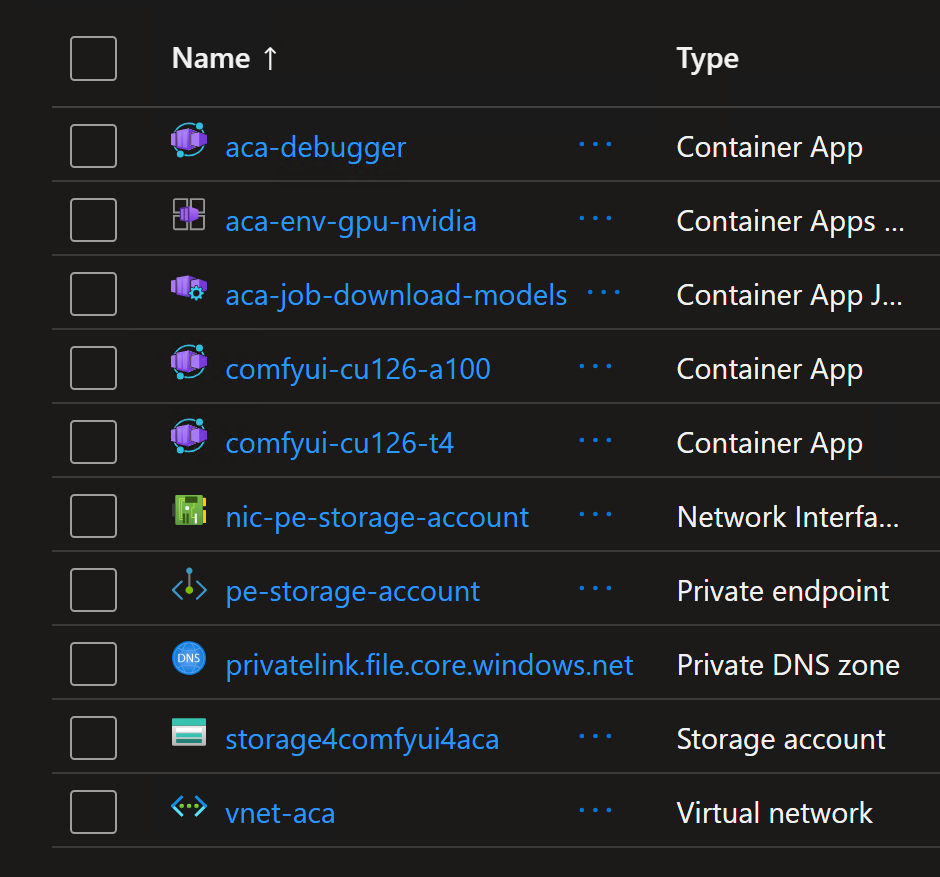
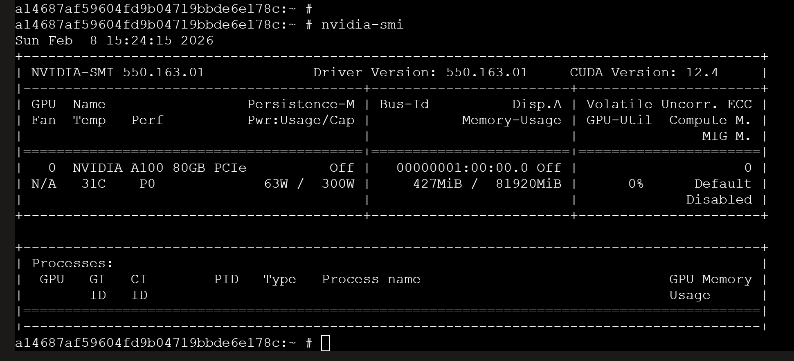

# Running ComfyUI on Container Apps with Serverless GPU (A100 & T4)

This repository contains the code and instructions to run ComfyUI on Azure Container Apps (ACA) with serverless GPU (A100 & T4). The infrastructure is provisioned using Terraform, and the ComfyUI application is deployed as a containerized workload on ACA.

## Prerequisites

- An Azure account with sufficient permissions to create resources.
- Terraform installed on your local machine.

## Infrastructure Provisioning

1. Clone the repository and navigate to the project directory.
2. Initialize Terraform and apply the configuration to provision the necessary Azure resources, including a resource group, virtual network, log analytics workspace, container app environment, storage account, and container app for downloading models.

```bash
terraform init
terraform apply --auto-approve
```

The foolowing resources will be created:



## ComfyUI Deployment

The ComfyUI application is deployed as a containerized workload on Azure Container Apps. The deployment includes a job that downloads the necessary models for ComfyUI to function properly.

1. The `aca_job_download_models.tf` file defines a job that runs a container with the necessary commands to download the models for ComfyUI. The job is configured to run on Consumption worksload profile and has a timeout of 1200 seconds.

2. The `download-models-comfyui.sh` script contains the commands to download the models from Hugging Face and save them to the appropriate directory in the ComfyUI application.

## Monitoring and Analytics

The Azure Log Analytics workspace is set up to collect logs and metrics from the container app environment. You can use Azure Monitor to view and analyze the logs and metrics for your ComfyUI deployment.

To view the properties and the usage of the GPU behind Container Apps, the command `nvidia-smi` is helpful.



ComfyUI produces rich logs about the operations.

## Important Notes

The storage account key is required to create the storage link in your Container Apps environment. Container Apps does not support identity-based access to Azure file shares. For that it is mandatory to disable `Secure Transfer` at the Storage Account. Src: https://learn.microsoft.com/en-us/azure/container-apps/storage-mounts-azure-files?tabs=bash#set-up-a-storage-account

Because of an issue with the Terraform provider, it won't create the Serverless GPU (A100 & T4) workload profiles. You will need to create them manually in the Azure Portal after running `terraform apply`.

Azure File Shares supports both `SMB` and `NFS`. Container Apps also supports both.

To mount NFS Azure Files, you must use a Container Apps environment with a custom VNet. The Storage account must be configured to allow access from the VNet either using `Service Endpoint` or `Private Endpoint`. Src: https://learn.microsoft.com/en-us/azure/container-apps/storage-mounts?tabs=nfs&pivots=azure-resource-manager#configuration-1

The NFS protocol can only be used from a machine inside of a virtual network.

🔍 SMB vs NFS — What’s the Difference?
SMB (Server Message Block) and NFS (Network File System) are two protocols used to provide shared file storage over a network.
They serve similar purposes but have different strengths, performance characteristics, and typical use cases.

| Feature | **SMB (CIFS)** | **NFS** |
|--------|-----------------|---------|
| **Origin** | Windows ecosystem | Unix/Linux ecosystem |
| **Typical OS support** | Windows (native), Linux (supported) | Linux/Unix (native), Windows (supported with extras) |
| **Protocol versions** | SMB 1.0 → 2.x → 3.x | NFS v3, v4.0, v4.1 |
| **Performance** | Slightly heavier, more overhead | Very fast, lightweight for Linux workloads |
| **Security** | Stronger (Kerberos, SMB3 encryption) | NFSv4 offers Kerberos & ACLs |
| **Authentication** | Active Directory, NTLM, Kerberos | AUTH_SYS, Kerberos |
| **File locking** | Mandatory locking | Advisory locking |
| **Best use cases** | Windows applications, Office files, user profiles | Linux workloads, Kubernetes pods, HPC, data processing |
| **Azure equivalent** | Azure Files (SMB) | Azure Files (NFS), Azure NetApp Files (NFS) |


## Resources

https://azureossd.github.io/2025/10/17/Setting-up-a-NFS-volume-with-Azure-Container-Apps/index.html
https://learn.microsoft.com/en-us/azure/container-apps/workload-profiles-overview

### Consumption profile details

| Profile names | vCPU range | Memory range | GPU type | Regions | Allocation |
| --- | --- | --- | --- | --- | --- |
| **Consumption** | 0.25-4 | 0.5-8 GiB |  | All supported regions | per replica |
| **Consumption-GPU-NC24-A100, Consumption-GPU-NC8as-T4** | 8–24 | 56–220 GiB | NVIDIA T4, A100 | To see a full list of available regions, see [serverless GPU supported regions](https://learn.microsoft.com/en-us/azure/container-apps/gpu-serverless-overview#supported-regions) | per replica |

All Consumption profiles support serverless scaling and are billed based on per‑replica usage.

To get the supported profiles for a specific region, you can use the Azure CLI command:

```sh
az containerapp env workload-profile list-supported --location swedencentral -o table
# Location       Name
# -------------  -------------------------
# swedencentral  D4
# swedencentral  D8
# swedencentral  D16
# swedencentral  D32
# swedencentral  E4
# swedencentral  E8
# swedencentral  E16
# swedencentral  E32
# swedencentral  Consumption
# swedencentral  Flex
# swedencentral  Consumption-GPU-NC24-A100
# swedencentral  Consumption-GPU-NC8as-T4
```

### Dedicated profile details

| Classification | Profile names | vCPU range | Memory range | GPU type | Regions | Allocation |
| --- | --- | --- | --- | --- | --- | --- |
| General Purpose | **D4, D8, D16, D32** | 4–32 | 16–128 GiB | None | All supported regions | per node |
| Memory Optimized | **E4, E8, E16, E32** | 4–32 | 32–256 GiB | None | All supported regions | per node |
| Confidential Compute | **DC4, DC8, DC16, DC32, DC48, DC64, DC96** | 4-96 | 16-384 GiB | None | UAENorth | per node |
| GPU | **NC24-A100, NC48-A100, NC96-A100** | 24–96 | 220–880 GiB | A100 | West US 3, North Europe | per node |

### Flexible profile details (preview)

| Profile names | vCPU range | Memory range | Regions | Allocation |
| --- | --- | --- | --- | --- |
| **Flexible** | 0.25-4 | 0.5-16 GiB | Australia East, Brazil South, Canada Central, Canada East, Central India, East Asia, Germany West Central, Korea Central, North Europe, Southeast Asia, Sweden Central, UK West, West Central US, West US 3 | per replica |
