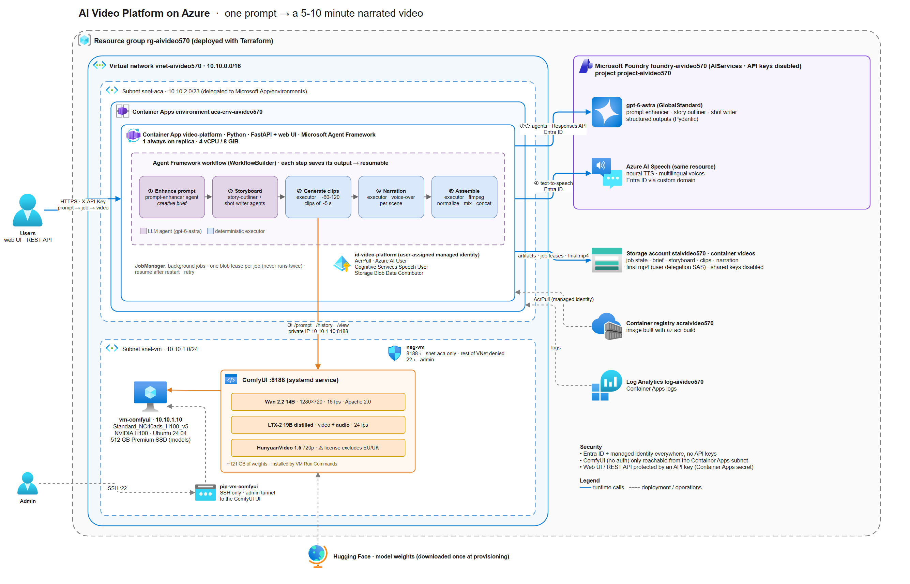

# AI Video Platform on Azure: prompt (and photo) in, 5-10 minute narrated video out

You type a prompt and, optionally, attach a photo of a person or a scene. The platform writes a story, turns it into dozens of shots, renders every shot with an open-weight video model on your own GPU VM, adds a voice-over and assembles the final video. With a photo, every shot starts from a keyframe redrawn from your photo, so the person or the place stays recognizable for the whole film.



> The diagram source is [images/architecture.drawio](images/architecture.drawio). Open it with [draw.io](https://app.diagrams.net) or the *Draw.io Integration* VS Code extension.

## How it works

Open-weight video models generate **~5 second clips**. A 5-10 minute video is therefore **60-120 clips** that must tell one coherent story. The orchestrator is a [Microsoft Agent Framework](https://learn.microsoft.com/agent-framework/overview/agent-framework-overview) **workflow** (`WorkflowBuilder`) in Python:

| Step | Executor | What it does |
|---|---|---|
| 1 | `EnhancePromptExecutor` | The **prompt-enhancer agent** (gpt-6-astra) turns the idea into a creative brief: title, visual style, setting, tone, and characters with a *fixed* visual description. With a reference photo, the agent **looks at the photo**: the people in it become the main characters (described faithfully, never named or identified) or the place becomes the setting, and `reference_notes` records what the photo shows. |
| 2 | `PlanStoryboardExecutor` | The **story-outliner agent** splits the story into scenes with narration and an exact shot budget (`duration / clip length`). The **shot-writer agents** then write the prompts for each scene in parallel. Each prompt is self-contained (it repeats the character and style descriptions so clips stay consistent) and follows that video model's prompting guide. With a photo, each shot gets two prompts: a **keyframe prompt** (an edit instruction: "keep the woman from image 1 identical, now ... medium shot, golden hour ...") and an **image-to-video prompt** that describes the motion and the camera. |
| 3 | `GenerateKeyframesExecutor` | Only with a photo (otherwise *skipped*). **Qwen-Image-Edit-2511** (4-step Lightning LoRA) redraws the photo into the first frame of every shot, at the video model's resolution. All keyframes are rendered before any clip, so ComfyUI loads each model once instead of swapping models for every shot. |
| 4 | `GenerateClipsExecutor` | Sends each shot to ComfyUI through its HTTP API (`/upload/image`, `/prompt`, `/history`, `/view`) and spreads the work over every server in `COMFYUI_URLS`: **text-to-video**, or **image-to-video** from the shot's keyframe. Failed clips are retried with a new seed. |
| 5 | `NarrateExecutor` | Azure AI Speech synthesizes each scene's voice-over, in the brief's language, using a multilingual neural voice. The narration is plain spoken text: screenplay-style speaker labels the LLM might add ("Narrator:", "Maya (V.O.):") are stripped so they are never read aloud. |
| 6 | `AssembleExecutor` | ffmpeg normalizes the clips to 1280x720 at 24 fps, concatenates each scene, and mixes in the narration (LTX-2's own audio stays underneath as ambience at 25% volume). If the narration is longer than the scene, the last frame is held. The scenes are then joined into `final.mp4`. |

The creative steps use LLM agents. The heavy steps are deterministic executors: an LLM tool-calling loop that runs for hours and 120 times would be slow, expensive and fragile. **Each step saves its output** (`input/reference.png`, `brief.json`, `storyboard.json`, `keyframes/shot_NNN.png`, `clips/shot_NNN.mp4`, `narration/scene_NNN.wav`) to Blob Storage. A job interrupted by a restart, deployment or failure resumes where it stopped, without re-rendering finished keyframes or clips. The `prompt_id` of every keyframe and clip sent to ComfyUI is saved too, so after a restart the orchestrator reattaches to a render that is still running instead of starting it again. Each running job holds a renewable **Blob lease**, so even when Container Apps briefly runs two replicas during a rollout, a job never runs twice.

### Videos from a photo

Open-weight video models only keep a person's likeness *within* one clip. To keep it across 60-120 independent clips, the platform never animates the photo directly: for each shot it first **redraws** the photo into that shot's framing, setting and lighting with Qwen-Image-Edit, then animates that keyframe with the video model's **image-to-video** workflow. Animating the photo itself would make every clip start from the same frame.

- The upload is checked and cleaned before it is stored: PNG, JPEG or WebP only, at most `MAX_IMAGE_MB` (10 MB by default), EXIF orientation applied, **all metadata (EXIF, GPS...) removed**, longest side capped at 2048 px, re-encoded as PNG.
- Each keyframe costs one extra 4-step Qwen-Image-Edit render (roughly 10-20 s on an H100) on top of the clip.
- The prompt is still required: it tells the agents what story to tell around the photo.

> [!IMPORTANT]
> Only upload photos you have the rights to, and of people who agreed to appear in an AI-generated video. The platform doesn't check consent: that responsibility is yours. The agents never try to name or identify the people in a photo.

## Video models

| Key | Model | Clip | Audio | License |
|---|---|---|---|---|
| `wan22` (default) | Wan 2.2 14B fp8 + LightX2V 4-step LoRA (T2V and I2V) | 1280x720, 81 frames at 16 fps (5 s) | No | **Apache 2.0**: commercial use allowed |
| `ltx2` | LTX-2 19B distilled, two-stage with x2 latent upscaler (same checkpoint for T2V and I2V) | 1280x704, 121 frames at 24 fps (5 s) | **Yes** (synchronized ambient) | Free under **$10M revenue**, paid license above |
| `hunyuan15` | HunyuanVideo 1.5 720p T2V / I2V (+ SigLIP vision encoder), 20 steps | 1280x720, 121 frames at 24 fps (5 s) | No | Tencent Hunyuan Community License: territory **reportedly excludes the EU, UK and South Korea**. Check before using it in France. |

Keyframes for videos made from a photo use **Qwen-Image-Edit-2511** (fp8) with the **4-step Lightning LoRA** (Apache 2.0), whatever the video model.

The workflows in [app/video_platform/comfy_workflows](app/video_platform/comfy_workflows) are API-format translations of the official ComfyUI templates (`video_wan2_2_14B_t2v`, `video_wan2_2_14B_i2v`, `video_ltx2_t2v_distilled`, `video_ltx2_i2v_distilled`, `video_hunyuan_video_1.5_720p_t2v`, `video_hunyuan_video_1.5_720p_i2v`, `image_qwen_image_edit_2511`). Values like `"{{prompt}}"`, `"{{seed}}"`, `"{{width}}"` and `"{{image}}"` are filled at run time with the right JSON type. Input images are uploaded with `/upload/image` to a per-job subfolder (`aivideo/<job id>`) of the ComfyUI server that renders them. To change a workflow, build it in the ComfyUI UI, use **Export (API)**, and put the placeholders back.

> [!NOTE]
> **Rendering time is dominated by the GPU.** Rough single-H100 estimates: Wan 2.2 (4 steps) takes about 1.5-3 min per clip, so 3-6 h for a 10-minute video. LTX-2 distilled is faster. HunyuanVideo 1.5 (20 steps) is the slowest. Measure on your own VM. To render clips in parallel, add more ComfyUI VMs to `COMFYUI_URLS` (comma-separated).

## Deploy

Prerequisites: Azure CLI (`az login`), Terraform >= 1.14, quota for `Standard_NC40ads_H100_v5` and for `gpt-6-astra` GlobalStandard in the chosen region (default `germanywestcentral`).

```sh
cd infra
terraform init
terraform apply   # about 1 h 30: GPU driver, ComfyUI, ~190 GB of model downloads, image build in ACR
```

Terraform creates:

- **VNets**: one for the GPU VM and one for Container Apps (in `italynorth`). They aren't peered, so the app reaches ComfyUI (port 8188) and the GPU stats exporter (port 8189) through the VM's static **public IP**, and the NSG allows both ports from anywhere.

> [!WARNING]
> ComfyUI has no authentication. Anyone who knows the VM's public IP can use it and queue jobs on your GPU. The GPU stats exporter has no authentication either, but it's read-only and exposes only GPU utilisation, VRAM, temperature and power, plus the VM's CPU and RAM usage. Deallocate the VM when you aren't using it.

- **GPU VM** (H100, Ubuntu 24.04, managed 512 GB Premium SSD). Run Commands install the NVIDIA driver (then reboot), install ComfyUI as a `systemd` service, download the models, and install a small GPU stats exporter (`nvidia-smi` plus the VM's CPU and RAM from `/proc` over HTTP, `gpu-stats` service on port 8189) ([infra/scripts](infra/scripts)). The scripts are idempotent. The exporter is independent of ComfyUI, so updating it never restarts a render.
- **Microsoft Foundry** resource (`AIServices`, keys disabled), a project, and the **gpt-6-astra** deployment. The same resource provides **Azure AI Speech**; its custom domain is what enables Entra ID auth for TTS.
- **Storage account** (shared keys disabled). Downloads use short-lived *user delegation* SAS URLs.
- **ACR**. The image is built with `az acr build` (no local Docker needed) and rebuilt whenever the app code changes.
- **Container Apps** environment in the VNet, plus the app (1 always-on replica, 4 vCPU / 8 GiB) with a user-assigned managed identity holding `AcrPull`, `Azure AI User`, `Cognitive Services Speech User` and `Storage Blob Data Contributor`.

```sh
terraform output app_url
terraform output -raw api_key
```

Open `app_url` in a browser, paste the API key, describe your video, optionally attach a photo (photo button, drag and drop, or paste), pick the duration and the model, then send it.

The web UI follows the GitHub Copilot app (dark theme). Your videos are listed in a sidebar. Each video opens as a session: your prompt (and photo), then a live timeline of what the agent is doing. The six pipeline steps expand into their operations:

- each agent call
- each keyframe (with its image once rendered) and each clip, with its ComfyUI server, prompt id, seed, prompt and retries
- each narration
- each ffmpeg and upload step

Each operation has a status and a duration, and shows the warnings logged while it ran. Retries keep the earlier runs, and steps resumed from saved artifacts show as *reused*.

The top bar shows the **live GPU, CPU and RAM utilisation** of the VM (average GPU util %, VRAM used/total, CPU % and RAM %, refreshed every 2 s), or *GPU offline* when the VM is deallocated. Click it to see, for each VM: CPU and RAM usage (with vCPU count, 1-minute load and a chart of the last 2 minutes), and for each GPU: utilisation, VRAM, temperature, power draw, and a chart of the last 2 minutes. The app reads it from the exporters listed in `GPU_STATS_URLS`; leave the variable empty to hide the badge.

> [!IMPORTANT]
> The GPU VM costs money even when idle. Deallocate it between batches with `az vm deallocate -g rg-aivideo570 -n vm-comfyui` and start it again with `az vm start` (ComfyUI starts automatically). Set `vm_spot = true` for a cheaper Spot VM; clips already rendered survive an eviction thanks to resume.

## REST API

All endpoints require the `X-API-Key` header (or `?key=` for browser links).

```sh
URL=$(terraform -chdir=infra output -raw app_url); KEY=$(terraform -chdir=infra output -raw api_key)

# start a job (202 Accepted)
curl -s -X POST "$URL/api/videos" -H "X-API-Key: $KEY" -H "Content-Type: application/json" \
  -d '{"prompt": "A documentary about a lighthouse keeper'\''s last winter on a remote Breton island", "duration_minutes": 5, "video_model": "wan22"}'

# start a job from a photo of a person or a scene: multipart, same JSON in the 'request' field
curl -s -X POST "$URL/api/videos" -H "X-API-Key: $KEY" \
  -F 'request={"prompt": "Her first trip to Kyoto, told as a travel diary", "duration_minutes": 2}' \
  -F "image=@photo.jpg"

curl -s "$URL/api/videos/<id>" -H "X-API-Key: $KEY"              # status, clips_done/clips_total
curl -s "$URL/api/videos/<id>/storyboard" -H "X-API-Key: $KEY"   # brief, scenes, narration, shot (and keyframe) prompts
curl -s "$URL/api/videos/<id>/operations" -H "X-API-Key: $KEY"   # timeline: steps, agent calls, keyframes, clips, ffmpeg...
curl -sN "$URL/api/videos/<id>/events?key=$KEY"                  # live Server-Sent Events: state, op, end
curl -sL "$URL/api/videos/<id>/download" -H "X-API-Key: $KEY" -o video.mp4
curl -sL "$URL/api/videos/<id>/image" -H "X-API-Key: $KEY" -o photo.png        # the cleaned reference photo
curl -sL "$URL/api/videos/<id>/keyframes/0" -H "X-API-Key: $KEY" -o shot0.png  # keyframe of shot 1 (0-based)
curl -s -X POST "$URL/api/videos/<id>/retry" -H "X-API-Key: $KEY" # resume a failed job
curl -s "$URL/api/gpu" -H "X-API-Key: $KEY"                      # live GPU, CPU and RAM stats of every VM in GPU_STATS_URLS
```

`/events` first sends the job state and all its operations, then each change as it happens, and `end` once the job is finished. If another replica runs the job, the stream follows it through the artifact store instead (about 2 s behind).

`POST /api/videos` accepts either a JSON body or `multipart/form-data` with a `request` field (the same JSON) and an optional `image` file (PNG, JPEG or WebP, up to `MAX_IMAGE_MB`, 10 MB by default). It answers 413 for a photo that is too large, 415 for a file that isn't a supported image, and 422 for an invalid request. `request.reference_image` in the job state is set by the server when a photo was uploaded; clients can't set it.

| Field | Default | Notes |
|---|---|---|
| `prompt` | (required) | Any language. The narration uses the prompt's language. Also required with a photo. |
| `duration_minutes` | `5` | 0.25 to 10. Use 0.25-0.5 for quick tests. |
| `video_model` | `wan22` | `wan22`, `ltx2` or `hunyuan15` |
| `narration` | `true` | `false` gives a silent video (or LTX-2 audio only) |
| `voice` | `en-US-AndrewMultilingualNeural` | Any Azure neural voice, e.g. `fr-FR-VivienneMultilingualNeural` |
| `seed` | random | Makes clip generation reproducible |

## Run the orchestrator locally

```sh
cd app
python -m venv .venv && .venv/Scripts/activate        # source .venv/bin/activate on Linux/macOS
pip install -r requirements.txt -r requirements-dev.txt
cp .env.sample .env                                    # fill in values from `terraform output` (COMFYUI_URLS = comfyui_url, GPU_STATS_URLS = gpu_stats_url)
python main.py                                         # http://localhost:8000
# or, without the API:
python generate.py "A short film about a robot learning to paint" --minutes 0.5 --model ltx2
python generate.py "Her first trip to Kyoto" --image photo.jpg --minutes 0.5      # from a photo
```

Locally it uses your `az login` identity (Terraform grants you the same roles as the app). With `STORAGE_ACCOUNT_URL` empty, jobs are written to `./output`. ffmpeg must be on your `PATH`.

## Tests

```sh
cd app
pytest
```

The tests check every ComfyUI workflow graph (text-to-video, image-to-video and keyframe: placeholders, links, node types) and the ComfyUI client (image upload, submit, poll, download, retry with a new seed). They also run the **real Agent Framework workflow with real ffmpeg** against a fake ComfyUI, fake LLM agents and fake TTS. That covers the whole pipeline (from a prompt, and from a photo for all three models: the agents get the photo, keyframes come before clips, clips start from their keyframe), the photo checks (formats, size, EXIF orientation and metadata removal), narration longer than a scene, resume without re-rendering keyframes or clips, reattaching to an in-flight ComfyUI prompt, concurrent retries, jobs locked by another replica, audio/video sync, the operation timeline (live, persisted, across retries and replicas), the REST API (JSON and multipart uploads) with its event stream, and the live GPU stats (exporter parsing of `nvidia-smi` and `/proc` CPU/RAM, offline VMs, `/api/gpu`).

## Project layout

```
570_ai_video_platform/
├── app/
│   ├── main.py                     # FastAPI entry point (container CMD)
│   ├── generate.py                 # CLI: one video, no API (--image for a photo)
│   ├── Dockerfile
│   ├── video_platform/
│   │   ├── workflow.py             # Agent Framework workflow (6 executors, each recorded as a timeline step)
│   │   ├── agents.py               # prompt-enhancer (sees the photo), story-outliner, shot-writer agents
│   │   ├── comfyui.py              # ComfyUI API client (image upload, T2V/I2V clips, keyframes) + multi-server pool
│   │   ├── gpu.py                  # live GPU, CPU and RAM stats from the VM exporters (/api/gpu)
│   │   ├── comfy_workflows/        # API-format workflows: T2V and I2V for the 3 models, Qwen-Image-Edit keyframes
│   │   ├── video_models.py         # model registry: resolution, fps, frames, T2V/I2V prompt guides, license
│   │   ├── images.py               # reference photo checks and cleanup (format, size, EXIF/GPS removal)
│   │   ├── speech.py               # Azure AI Speech TTS (Entra ID)
│   │   ├── media.py                # ffmpeg: normalize, concat, narration mix
│   │   ├── storage.py              # Blob / local artifact store
│   │   ├── jobs.py                 # background jobs, resume, retry, live notifications
│   │   ├── operations.py           # operation timeline (steps, agent calls, keyframes, clips...) + log capture
│   │   ├── api.py                  # REST API (JSON or multipart with a photo) + Server-Sent Events
│   │   └── static/index.html       # web UI (Copilot-style sessions, photo upload, live timeline)
│   └── tests/
├── images/architecture.drawio      # architecture diagram (draw.io, Azure icons) + .png export
└── infra/                          # Terraform + VM scripts
```

## Going further

- **Character consistency without a photo**: the keyframe + image-to-video path already exists for uploaded photos. Text-only videos could use it too: generate a reference image per character (e.g. Qwen-Image or Z-Image-Turbo, already used in [550_comfyui_on_vm](../550_comfyui_on_vm)) and feed it to `GenerateKeyframesExecutor`.
- **Several photos**: `TextEncodeQwenImageEditPlus` accepts up to three images, e.g. two people and a place.
- **Scale out**: run several GPU VMs (or a VM Scale Set) and list them all in `COMFYUI_URLS` (and their exporters in `GPU_STATS_URLS`).
- **Music**: add a music-generation step and mix it under the narration in `media.mix_narration`.
- **Hosted agent**: the same workflow can be exposed as a Foundry hosted agent with `agent-framework-foundry-hosting`.
