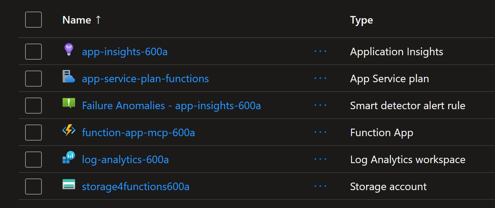
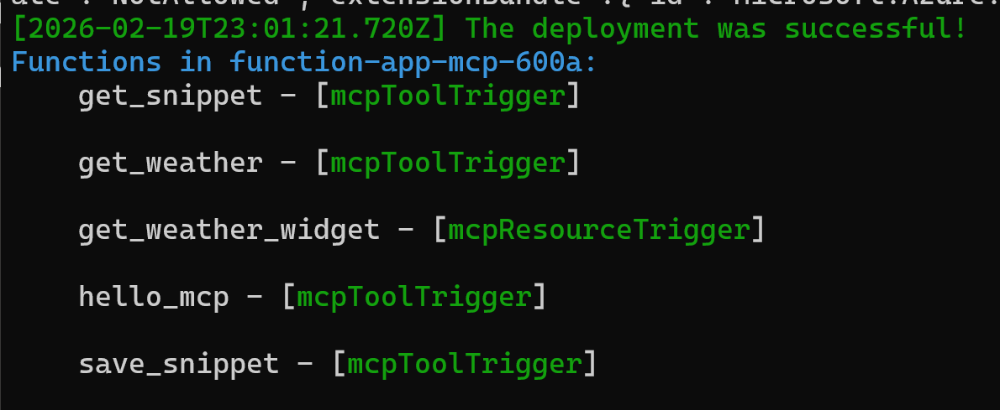
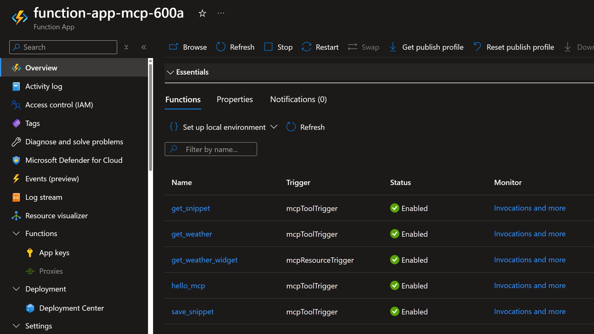
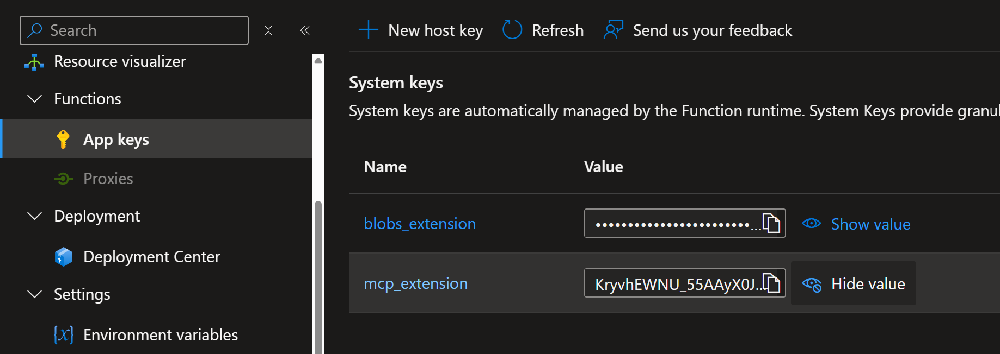
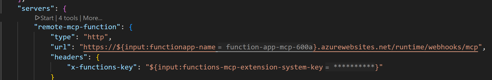

# Deploying an MCP Server on Azure Functions Flex Consumption

## 1. Deploy the Azure resources using Terraform

Use Terraform to deploy and configure the required resources. Make sure to run the command inside the `infra` folder.

```sh
terraform init -upgrade
terraform apply -auto-approve
```

The following resources will be created.



## 2. Deploy the MCP Server as Azure Functions

Use the sample MCP Server available under `mcp_server` folder implementation in Python and NodeJs.
Deploy it to Azure Functions using `func azure functionapp publish` command.  Make sure to run the command inside the `mcp_server` folder.

```sh
func azure functionapp publish <function-app-name> --build remote
```

Verify that the functions are deployed correctly either by seeing their names at the end of the logs like following:



or by seeing the functions in the overview page of the Function Apps in Azure portal like the following:



## 3. Use the MCP Server in VS Code with Github Copilot

To tell VS Code to use this MCP Server in Github Copilot, you need to add the following JSON configuration to the root folder in `.vscode` folder inside `mcp.json` file:

```json
{
    "inputs": [
        
        {
            "type": "promptString",
            "id": "functionapp-name",
            "description": "Azure Functions App Name"
        },
        {
            "type": "promptString",
            "id": "functions-mcp-extension-system-key",
            "description": "Azure Functions MCP Extension System Key",
            "password": true
        }
    ],
    "servers": {
        "remote-mcp-function": {
            "type": "http",
            "url": "https://${input:functionapp-name}.azurewebsites.net/runtime/webhooks/mcp",
            "headers": {
                "x-functions-key": "${input:functions-mcp-extension-system-key}"
            }
        },
        "local-mcp-function": {
            "type": "http",
            "url": "http://0.0.0.0:7071/runtime/webhooks/mcp"
        }
    }
}
```

Note how it takes two parameter inputs: the name of the Azure Function and the system key of the MCP Extension. This latter could be found in the Azure Portal under `App Keys`.



Or you can also retrieve it using Azure command line:

```sh
az functionapp keys list -g rg-mcp-server-on-functions-600a -n function-app-mcp-600a --query systemKeys.mcp_extension -o tsv
# 33enEV9LLxYxQBrohMD9SpxjA9T5wxMba1SGBn5pVLISAzFucxry4Q==
```

Now you need to start the MCP Server by clicking the Start link in the mcp.json file.



Then you should be able to use it in the Chat window in Github Copilot.

Here are some prompts to try:

```plaintext
Say Hello
```

```plaintext
Save this snippet as snippet1
```

```plaintext
Retrieve snippet1 and apply to newFile.py
```

You should see the saved snippet in the Storage Account -> Blob Containers.

## More resources

This lab was built on the work done in these labs:

- https://github.com/Azure-Samples/remote-mcp-functions-python
- https://github.com/0GiS0/mcp-server-azure-function