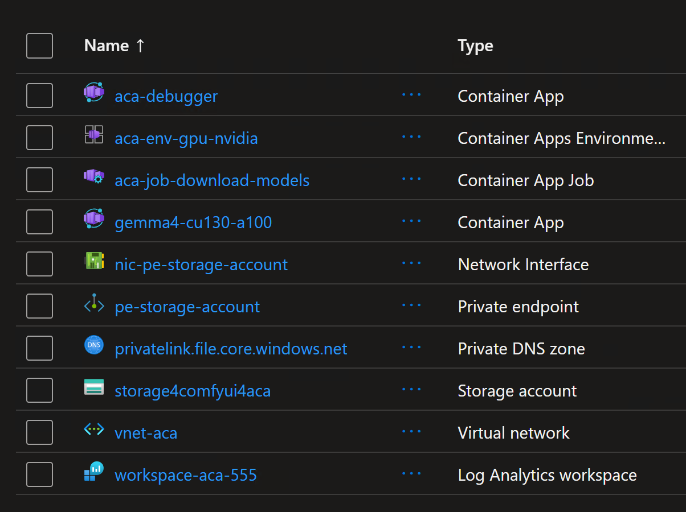

# Running Gemma 4 on Container Apps with Serverless GPU (A100 & T4)

This repository contains the code and instructions to run Gemma 4 on Azure Container Apps (ACA) with serverless GPU (A100 & T4). The infrastructure is provisioned using Terraform, and the Gemma 4 model is deployed as a containerized workload on ACA.

## Prerequisites

- An Azure account with sufficient permissions to create resources.
- Terraform installed on your local machine.

## Infrastructure Provisioning

1. Clone the repository and navigate to the project directory.
2. Initialize Terraform and apply the configuration to provision the necessary Azure resources, including a resource group, virtual network, log analytics workspace, container app environment, storage account, and container app for downloading models.

```bash
terraform init
terraform apply --auto-approve
```

The foolowing resources will be created:



## Important notes

The Gemma 4 E4B model weights alone consume more than what the T4 can hold. The model already used 15.28 GiB and still needed another 1.25 GiB when it crashed while creating the lm_head layer.

